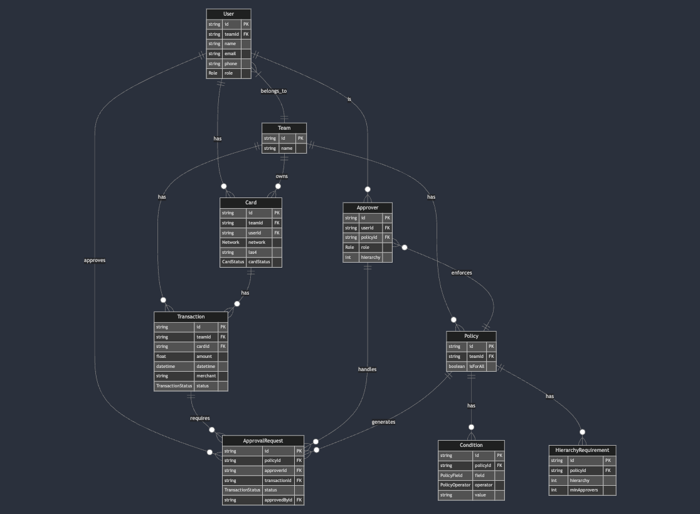

### Clyr challenge

#### Database


#### API
[Swagger](http://localhost:3000/api-docs)


#### How to run
Project is set to run with `docker compose`
```bash
docker-compose build
docker-compose up
```

#### How to run tests
1. configure .env for a up and running database. (Didn't mock database on porpuse wanted to see the final result)
```bash
npm run test
```

##### Notable considerations
1. Didn't integrate SMS service, used [mailtra.io](https://mailtrap.io/) for email testing. In the future is allowed to create several providers to use different ways of notificate. 
2. Didn't use a template compiler for email.
3. An exception handler is integrated to safely fail.
4. One thing that is missing is when sending the email a link to approve it. As I'm using a POST to change the state of the transaction, the link should redirect to a frontend with a dropdown and I had no time to do it.
5. Used `x-auth` header to simulate a token and add validation and security


#### How it works?
When a transaction is received by the webhook it will first create it on the database and then fire a `processTransaction` event.
This event will be the one that will match all the policies with the transaction and approvers and will notify them by email by firing a `sendNotification` event.
The `sendNotification` event will be the one that will send the email to the approver.

When a user changes the state of their part of the transaction a `processChangeStateTransaction` event will be fired to check if all the conditions are met to either "approve" or "reject" the whole transaction.

Last there is an endpoint to create policies that doesn't fire.

#### How to test

1. Create a policy
```curl
curl --request POST \
  --url http://localhost:3000/policies \
  --header 'Content-Type: application/json' \
  --header 'User-Agent: insomnia/9.0.0' \
  --header 'x-auth: ecc3184d-41be-4228-8e56-13ea6d6a5483' \
  --data '{
  "teamId": "ecc3184d-41be-4228-8e56-13ea6d6a5483",
  "isForAll": false,
  "conditions": [
    {
      "field": "amount",
      "operator": "GREATER_THAN",
      "value": "1000"
    },
    {
      "field": "merchant",
      "operator": "EQUALS",
      "value": "Amazon"
    }
  ],
  "hierarchyRequirements": [
    {
      "hierarchy": 0,
      "minApprovers": 1
    },
    {
      "hierarchy": 1,
      "minApprovers": 2
    }
  ],
  "approvers": [
    {
      "userId": "ecc3184d-41be-4228-8e56-13ea6d6a5483",
      "hierarchy": 0
    },
    {
      "role": "APPROVER",
      "hierarchy": 1
    }
  ]
}'
```

2. Create a transaction
```curl
curl --request POST \
  --url http://localhost:3000/transactions/webhooks \
  --header 'Content-Type: application/json' \
  --header 'User-Agent: insomnia/8.2.0' \
  --data '{
    "merchant": "Amazon",
		"amount": 10000,
    "datetime": "2024-09-06",
    "cardId": "ecc3184d-41be-4228-8e56-13ea6d6a5483", 
    "teamId": "ecc3184d-41be-4228-8e56-13ea6d6a5483"
}
'
```
Those cardId and teamId are already in the database
3. Check the email


4. Approve or reject the transaction
```curl
curl --request POST \
  --url 'http://localhost:3000/transactions/<change for transaction id>/status?policyId=<change if for policy id>&approverId=<change id for approver id>' \
  --header 'Content-Type: application/json' \
  --header 'User-Agent: insomnia/10.0.0' \
  --header 'x-auth: ecc3184d-41be-4228-8e56-13ea6d6a5482' \
  --data '{
	"status": "APPROVED"
}'
```


#### For an up and running example
1. Create transaction
```curl
curl --request POST \
  --url http://localhost:3000/transactions/webhooks \
  --header 'Content-Type: application/json' \
  --header 'User-Agent: insomnia/8.2.0' \
  --data '{
    "merchant": "Home Depot",
		"amount": 10000,
    "datetime": "2024-09-06",
    "cardId": "ecc3184d-41be-4228-8e56-13ea6d6a5483", 
    "teamId": "ecc3184d-41be-4228-8e56-13ea6d6a5483"
}
'
```
2. Check email
3. Change status of the transaction
```curl
curl --request POST \
  --url 'http://localhost:3000/transactions/ecc3184d-41be-4228-8e56-13ea6d6a5483/status?policyId=ecc3184d-41be-4228-8e56-13ea6d6a5481&approverId=ecc3184d-41be-4228-8e56-13ea6d6a5483' \
  --header 'Content-Type: application/json' \
  --header 'User-Agent: insomnia/10.0.0' \
  --header 'x-auth: ecc3184d-41be-4228-8e56-13ea6d6a5483' \
  --data '{
	"status": "APPROVED"
}'
```


#### Todos


